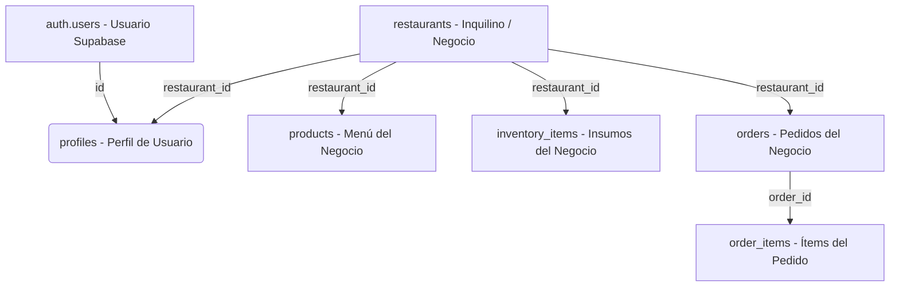

# 📚 Wiki y Manual Operativo — ComandApp

Bienvenido a la documentación oficial y guía de uso de **ComandApp (ComandAdmin & Tiendas Online con Subdominio)**. En esta wiki encontrarás los manuales operativos para cada función del sistema, la explicación de su diseño artesanal y rústico (*"hecho en casa"*), así como la guía técnica detallada para dar de alta nuevos comercios gastronómicos en una arquitectura multi-inquilino (*multi-tenant*).

> 🌐 **Versión Interactiva en GitHub:** Puedes consultar esta misma documentación navegando por páginas y con menú lateral en:  
> 👉 **[Wiki Oficial en GitHub](https://github.com/PP-II-IES-N-9-012/gestor-rotiseria/wiki)**

---

## 📑 Índice de Contenidos

1. [Visión General del Sistema, Roles y Estética Rústica](#1-visión-general-del-sistema-roles-y-estética-rústica)
2. [Landing Page Institucional y de Ventas (`/`)](#2-landing-page-institucional-y-de-ventas-)
3. [Guía de Uso: Tienda Online por Subdominio (E-Commerce)](#3-guía-de-uso-tienda-online-por-subdominio-e-commerce)
   - [3.1 Navegación, Catálogo Artesanal y Subdominios](#31-navegación-catálogo-artesanal-y-subdominios)
   - [3.2 Gestión de la Comanda (Carrito)](#32-gestión-de-la-comanda-carrito)
   - [3.3 Checkout y Confirmación Directa a Cocina](#33-checkout-y-confirmación-directa-a-cocina)
   - [3.4 Seguimiento en Tiempo Real](#34-seguimiento-en-tiempo-real)
4. [Guía de Uso: Panel de Administración y Cocina (ComandAdmin)](#4-guía-de-uso-panel-de-administración-y-cocina-comandadmin)
   - [4.1 Inicio de Sesión](#41-inicio-de-sesión)
   - [4.2 Dashboard Gerencial y KPIs](#42-dashboard-gerencial-y-kpis)
   - [4.3 Punto de Venta (POS / Mostrador)](#43-punto-de-venta-pos--mostrador)
   - [4.4 Comandera de Cocina en Vivo (KDS)](#44-comandera-de-cocina-en-vivo-kds)
   - [4.5 Control de Inventario y Alertas](#45-control-de-inventario-y-alertas)
   - [4.6 Configuración del Local](#46-configuración-del-local)
5. [🏢 GUÍA MAESTRA: Cómo crear un nuevo negocio para un nuevo cliente (Multi-Tenant)](#5--guía-maestra-cómo-crear-un-nuevo-negocio-para-un-nuevo-cliente-multi-tenant)
   - [5.1 Comprensión del Modelo de Datos](#51-comprensión-del-modelo-de-datos)
   - [5.2 Paso 1: Crear el Usuario en Supabase Auth](#52-paso-1-crear-el-usuario-en-supabase-auth)
   - [5.3 Paso 2: Registrar el Nuevo Restaurante](#53-paso-2-registrar-el-nuevo-restaurante)
   - [5.4 Paso 3: Asignar el Perfil de Administrador al Usuario](#54-paso-3-asignar-el-perfil-de-administrador-al-usuario)
   - [5.5 Paso 4: Carga del Menú Inicial (Productos)](#55-paso-4-carga-del-menú-inicial-productos)
   - [5.6 Paso 5: Carga del Inventario Inicial (Insumos)](#56-paso-5-carga-del-inventario-inicial-insumos)
   - [5.7 📋 Script SQL Unificado (Plantilla "Copiar y Pegar")](#57--script-sql-unificado-plantilla-copiar-y-pegar)
   - [5.8 Verificación de Aislamiento y Acceso](#58-verificación-de-aislamiento-y-acceso)
   - [5.9 Subdominios, Proxy de Next.js y Despliegue en Producción](#59-subdominios-proxy-de-nextjs-y-despliegue-en-producción)
6. [Flujo Operativo de Punta a Punta (Ciclo de Vida de una Orden)](#6-flujo-operativo-de-punta-a-punta-ciclo-de-vida-de-una-orden)
7. [Preguntas Frecuentes y Resolución de Problemas](#7-preguntas-frecuentes-y-resolución-de-problemas)

---

## 1. Visión General del Sistema, Roles y Estética Rústica

**ComandApp** opera bajo tres grandes dimensiones conectadas:
1. **Landing Page Corporativa (`/`):** La dirección base que presenta la propuesta de valor de ComandApp, planes, simulador de subdominios y captación de clientes gastronómicos.
2. **Tienda Online Pública por Subdominio (`tunegocio.comandapp.com` o `/tienda/[tenant]`):** La cara visible hacia los comensales, donde exploran el menú artesanal, arman su comanda y siguen su pedido en vivo sin necesidad de registro forzoso.
3. **Panel Privado de Cocina y Gerencia (ComandAdmin - `/admin`):** El sistema operativo interno para gerentes, cajeros de mostrador y cocineros.

### 🎨 Filosofía Visual: Rústica y "Hecho en Casa"
El diseño se aleja deliberadamente de los tonos fríos y corporativos para evocar la calidez de una rotisería de barrio, un bodegón o una casa de comidas familiares:
- **Paleta de Colores:** Carbón cálido (`#151210`), terracota de brasas y horno de barro (`#d34e2c`), corteza dorada (`#e59324`) y acentos de madera/pergamino.
- **Tipografía:** Encabezados en tipografía serif clásica (*Playfair Display*) combinada con fuentes de alta legibilidad en pantallas táctiles (*Outfit* e *Inter*).
- **Micro-interacciones:** Distintivos artesanales (*"🔥 100% Casero"*, *"🥔 Papas Rústicas"*), confirmación con rebote *"¡En la comanda!"* y tarjetas estilo pizarra de especialidades.

### Roles de Usuario en la Base de Datos (`user_role`):
* `admin`: Acceso total a todas las secciones de su local (KPIs, POS, Cocina, Inventario y Configuración).
* `seller`: Orientado al operador de mostrador y cobro telefónico (Punto de Venta).
* `cook`: Orientado a la pantalla de cocina (KDS) para mover órdenes en preparación y listas.
* `customer`: Perfil de comensal registrado (opcional para clientes recurrentes).

---

## 2. Landing Page Institucional y de Ventas (`/`)

* **URL:** `/` (Dirección base principal del sistema).
* **Objetivo:** Mostrar y vender ComandApp a dueños de rotiserías, casas de empanadas, pizzerías y bodegones.
* **Secciones Principales:**
  1. **Hero Section:** Mensaje de impacto contra las comisiones del 35% de las apps de delivery: *"Tu rotisería online, comandas en vivo y 0% comisiones"*.
  2. **Demostrador Interactivo en 4 Pestañas:**
     - *Tienda con tu Subdominio:* Previsualización de la carta con fotos caseras.
     - *Comandera de Cocina (KDS):* Cómo los cocineros ven las comandas en pantalla sin papel.
     - *Mostrador & Caja (POS):* Cobro ágil de mostrador en 2 clics.
     - *Inventario:* Alertas de insumos críticos.
  3. **Simulador de Subdominios:** El usuario escribe el nombre de su comercio (ej: `don-carlos`) y visualiza su enlace directo: `https://[local].comandapp.com` con botón interactivo para probarlo en el acto.
  4. **Propuesta 0% Comisiones:** Comparativa frente a los altos costos de intermediarios de delivery.
  5. **Planes y Precios:** Modelo de suscripción mensual transparente (*Rotisería de Barrio*, *Cocina a Pleno*, *Franquicias & Bodegones*).
  6. **Casos de Éxito:** Testimonios de rotiserías reales que aumentaron su rentabilidad.
  7. **Preguntas Frecuentes (FAQ):** Compatibilidad con celulares y computadoras viejas, soporte e instalación.

---

## 3. Guía de Uso: Tienda Online por Subdominio (E-Commerce)

### 3.1 Navegación, Catálogo Artesanal y Subdominios
* **URL:** Acceso mediante subdominio propio (`don-carlos.comandapp.com`), ruta general `/tienda` o tenant específico `/tienda/[tenant]`.
* **Cabecera del Comercio:**
  - Nombre del local comercial destacado.
  - Subtítulo de confianza: *"ComandApp • Sabor Casero"*.
  - Dirección física, teléfono y demora estimada de despacho.
* **Organización del Menú por Categorías:**
  - *🔥 Especialidades al Spiedo y Horno* (Pollo al spiedo con papas rústicas, matambrito tiernizado a la pizza).
  - *🥟 Empanadas Caseras* (Criollas a cuchillo, jamón y queso, fugazzeta 4 quesos).
  - *🍝 Pastas Artesanales & Minutas* (Milanesa napolitana, sorrentinos caseros).
  - *🥗 Tartas & Guarniciones* (Pascualina, papas provenzal, tortilla de papas).
* Cada tarjeta exhibe foto del plato, descripción de ingredientes caseros, precio unitario destacado y botón interactivo **"Pedir al plato"**.

### 3.2 Gestión de la Comanda (Carrito)
* En la barra superior, el botón **"Mi Comanda"** refleja la cantidad de artículos y suma total en tiempo real.
* Al pulsar sobre la comanda se navega a `/carrito`.
* Dentro de la comanda, el cliente puede:
  - Incrementar o disminuir unidades mediante los controles `+` y `-`.
  - Quitar un plato con el botón de papelera.
  - Observar el desglose del total a abonar.

### 3.3 Checkout y Confirmación Directa a Cocina
En el lateral de `/carrito`, el cliente completa el pedido en menos de 1 minuto sin requerir contraseña:
1. **Nombre y Apellido:** Para identificar al comensal en la comanda.
2. **Teléfono (WhatsApp):** Para coordinar la entrega o avisar demoras.
3. **Modalidad de Entrega:**
   - *🛵 Envío a Domicilio (Delivery):* Despliega el campo obligatorio de dirección de entrega.
   - *🏪 Retiro en Local (Take Away):* El costo de entrega se computa como gratis.
4. **Forma de Pago:**
   - *Efectivo:* Se cancela contra entrega o al retirar.
   - *MercadoPago / Transferencia:* Modalidad electrónica.
5. **Aclaraciones para la Cocina (Opcional):** Ej. *"Sin cebolla, tocar timbre 2B"*.
6. Al presionar **"Confirmar Pedido"**, la orden se guarda en PostgreSQL y se envía de forma inmediata a la pantalla de cocina.

### 3.4 Seguimiento en Tiempo Real
* **URL:** `/seguimiento`
* El cliente ingresa el código identificador de su orden (ej: `b326adf8-3a44...`).
* La pantalla exhibe:
  - Número de comanda simplificado (ej: `#B326ADF8`).
  - Total del pedido y modalidad.
  - **Línea de Tiempo Gráfica de 4 Etapas:**
    1. 🟡 **Comanda Recibida (Pending):** La orden ingresó al sistema y está en fila de espera.
    2. 🟠 **Marchando en el Fuego (Preparing):** Los cocineros están preparando los alimentos en el horno o plancha.
    3. 🟢 **¡Platos Listos! (Ready):** El pedido está empaquetado y listo para entregar al repartidor o en mostrador.
    4. ⚪ **Entregado (Completed):** La orden fue entregada con éxito.
  - Resumen detallado con platos y cantidades solicitadas.

---

## 4. Guía de Uso: Panel de Administración y Cocina (ComandAdmin)

### 4.1 Inicio de Sesión
* **URL:** `/login`
* Ingreso mediante correo electrónico y contraseña registrados en Supabase Auth.
* El sistema valida que el usuario pertenezca a un comercio en `profiles`. Si no lo tiene, deniega el acceso para resguardar la seguridad multi-tenant.
* Al autenticarse, redirige de forma automática al Dashboard (`/admin`).

### 4.2 Dashboard Gerencial y KPIs
* **URL:** `/admin`
* **Tarjetas de Estadísticas del Día:**
  - 💵 **Ventas de hoy:** Sumatoria en pesos de todas las órdenes del día actual.
  - 🛍️ **Pedidos Totales:** Conteo de comandas recibidas hoy.
  - 📈 **Ticket Promedio:** Promedio de gasto por comanda (`Ventas / Pedidos`).
  - ⚠️ **Insumos Críticos:** Conteo de materias primas cuya existencia está por debajo o igual al stock mínimo.
* **Alertas de Inventario:** Lista de materias primas en zona roja con botón de recarga rápida (+10 unidades).

### 4.3 Punto de Venta (POS / Mostrador)
* **URL:** `/admin/pos`
* Diseñado para atender mostrador presencial o pedidos telefónicos a máxima velocidad:
  - **Buscador Dinámico:** Escribe el nombre del plato y filtra al instante.
  - **Filtro por Categorías:** Botones para alternar entre Spiedo, Empanadas, Minutas, etc.
  - **Ticket Lateral:** Clic en cualquier producto lo añade al ticket con subtotal y cantidades.
  - **Medios de Pago:** Selección rápida entre *Efectivo* y *Tarjeta / Transferencia*.
  - **Confirmar Venta:** Dispara la orden a la cocina en el mismo segundo con estado `pending`.

### 4.4 Comandera de Cocina en Vivo (KDS)
* **URL:** `/admin/cocina`
* **Sincronización en tiempo real:** Utiliza canales WebSocket de Supabase (`supabase.channel('kitchen-orders')`) para que cualquier nuevo pedido aparezca con sonido sin refrescar la pantalla (`F5`).
* **Columnas de Gestión:**
  1. **Pendientes:** Muestra hora del pedido, código de comanda, platos, cantidades y aclaraciones.
     - Botón: **"Comenzar Preparación"** ➔ Pasa a *En Preparación*.
  2. **En Preparación:** Resaltada con cronómetro de tiempo transcurrido.
     - Botón: **"Marcar Listo"** ➔ Pasa a *Listo*.
  3. **Listos (Recientes):** Historial visual para empaquetar y entregar al repartidor o cliente.

### 4.5 Control de Inventario y Alertas
* **URL:** `/admin/inventario`
* Tabla con insumos del restaurante (Carne Picada, Harina, Pollo Entero, Papas, Muzzarella):
  - Stock Actual y Unidad de medida (`kg`, `litros`, `unidades`).
  - Stock Mínimo fijado como umbral de seguridad.
  - Estado: Etiqueta verde **"Normal"** o roja parpadeante **"Crítico"**.
* Botón **"+ Ingreso"**: Permite sumar kilos o unidades recibidas de proveedores en el acto.

### 4.6 Configuración del Local
* **URL:** `/admin/configuracion`
* Actualización de datos públicos del establecimiento:
  - Nombre del local comercial.
  - Subdominio público asignado (ej: `don-carlos`).
  - Teléfono de contacto.
  - Dirección física del establecimiento.
  - Descripción y propuesta gastronómica.

---

## 5. 🏢 GUÍA MAESTRA: Cómo crear un nuevo negocio para un nuevo cliente (Multi-Tenant)

Esta sección explica cómo dar de alta un **nuevo cliente (restaurante o rotisería)** en el sistema, asegurando aislamiento total de datos con Row Level Security (RLS).

### 5.1 Comprensión del Modelo de Datos



1. **`restaurants`**: Representa el negocio (nombre, subdominio único).
2. **`auth.users`**: Cuenta de inicio de sesión gestionada por Supabase Auth (correo y contraseña).
3. **`profiles`**: Conecta al usuario con su negocio (`restaurant_id`) y su rol (`admin`).
4. **Tablas hijas (`products`, `inventory_items`, `orders`)**: Tienen una columna obligatoria `restaurant_id`.

---

### 5.2 Paso 1: Crear el Usuario en Supabase Auth

1. Ve a tu panel de **Supabase** ([https://supabase.com/dashboard](https://supabase.com/dashboard)).
2. En el menú lateral izquierdo, haz clic en **Authentication** ➔ **Users**.
3. Haz clic en **"Add user"** ➔ **"Create user"**.
4. Ingresa los datos del nuevo cliente:
   - **User Email:** Por ejemplo `admin@doncarlos.com`.
   - **User Password:** Contraseña provisoria o definitiva.
   - Marca la casilla **"Auto Confirm User?"** para que pueda ingresar de inmediato.
5. Haz clic en **"Create user"**.
6. Copia su **UUID** (User UID).  
   *Ejemplo: `a1b2c3d4-e5f6-7890-abcd-ef1234567890`*.

---

### 5.3 Paso 2: Registrar el Nuevo Restaurante

En el **SQL Editor** de Supabase, ejecuta la inserción del nuevo comercio:

```sql
INSERT INTO public.restaurants (name, subdomain) 
VALUES ('Rotisería Don Carlos', 'don-carlos')
RETURNING id;
```
> Copia el `id` (UUID) devuelto por la consulta. Será el `restaurant_id` del nuevo cliente.

---

### 5.4 Paso 3: Asignar el Perfil de Administrador al Usuario

Enlaza el usuario de Supabase Auth con su restaurante dentro de la tabla `profiles`:

```sql
INSERT INTO public.profiles (id, restaurant_id, full_name, role, phone, address)
VALUES (
  'AQUÍ_EL_UUID_DEL_USUARIO_AUTH',
  'AQUÍ_EL_UUID_DEL_RESTAURANTE',
  'Carlos Gómez',
  'admin',
  '+54 9 11 5555-4321',
  'Av. San Martín 789'
);
```

---

### 5.5 Paso 4: Carga del Menú Inicial (Productos)

Agrega los platos típicos vinculados a su `restaurant_id`:

```sql
INSERT INTO public.products (restaurant_id, code, name, description, price, category, is_available)
VALUES 
('AQUÍ_EL_UUID_DEL_RESTAURANTE', 'POLL-ALSP', 'Pollo al Spiedo con Papas Rústicas', 'Pollo asado a las brasas con guarnición de papas al horno.', 12500, 'Del Horno & Spiedo', true),
('AQUÍ_EL_UUID_DEL_RESTAURANTE', 'TART-VERD', 'Tarta Pascualina al Horno', 'Masa casera con acelga, espinaca, ricota y huevo.', 7200, 'Tartas & Guarniciones', true),
('AQUÍ_EL_UUID_DEL_RESTAURANTE', 'EMP-CRI', 'Empanada Criolla Cortada a Cuchillo', 'Carne suave, huevo picado y cebolla de verdeo.', 1600, 'Empanadas Caseras', true);
```

---

### 5.6 Paso 5: Carga del Inventario Inicial (Insumos)

Registra la materia prima que el local utilizará para sus preparaciones:

```sql
INSERT INTO public.inventory_items (restaurant_id, name, quantity_available, unit, min_stock)
VALUES 
('AQUÍ_EL_UUID_DEL_RESTAURANTE', 'Pollo Entero', 25.0, 'unidades', 5),
('AQUÍ_EL_UUID_DEL_RESTAURANTE', 'Papas Blancas', 80.0, 'kg', 20),
('AQUÍ_EL_UUID_DEL_RESTAURANTE', 'Acelga Fresca', 15.0, 'kg', 4),
('AQUÍ_EL_UUID_DEL_RESTAURANTE', 'Queso Parmesano', 8.0, 'kg', 2);
```

---

### 5.7 📋 Script SQL Unificado (Plantilla "Copiar y Pegar")

Para mayor rapidez, puedes ejecutar el siguiente bloque SQL unificado en el **SQL Editor** de Supabase reemplazando el correo del usuario ya creado en Auth:

```sql
DO $$
DECLARE
  v_user_email TEXT := 'admin@doncarlos.com'; -- 👈 Cambiar por el email creado en Auth
  v_user_id UUID;
  v_restaurant_id UUID;
BEGIN
  -- 1. Obtener el ID del usuario creado en auth.users
  SELECT id INTO v_user_id 
  FROM auth.users 
  WHERE email = v_user_email;

  IF v_user_id IS NULL THEN
    RAISE EXCEPTION 'El usuario con correo % no existe en auth.users. Créalo primero en Authentication > Users.', v_user_email;
  END IF;

  -- 2. Crear el nuevo negocio (Restaurante)
  INSERT INTO public.restaurants (name, subdomain)
  VALUES ('Rotisería Don Carlos', 'don-carlos')
  RETURNING id INTO v_restaurant_id;

  -- 3. Crear el perfil de Administrador vinculado al restaurante
  INSERT INTO public.profiles (id, restaurant_id, full_name, role, phone, address)
  VALUES (
    v_user_id,
    v_restaurant_id,
    'Carlos Gómez (Titular)',
    'admin',
    '+54 11 9999-8888',
    'Av. San Martín 789'
  );

  -- 4. Insertar productos de muestra para el nuevo negocio
  INSERT INTO public.products (restaurant_id, code, name, description, price, category, is_available)
  VALUES 
    (v_restaurant_id, 'POLL-01', 'Pollo al Spiedo Clásico', 'Dorado y jugoso con especias.', 12500, 'Del Horno & Spiedo', true),
    (v_restaurant_id, 'PAP-01', 'Porción de Papas Fritas Rústicas', 'Papas cortadas a mano con provenzal.', 4900, 'Tartas & Guarniciones', true),
    (v_restaurant_id, 'TART-01', 'Tarta Pascualina al Horno', 'Masa casera hojaldrada con acelga y ricota.', 7200, 'Tartas & Guarniciones', true);

  -- 5. Insertar inventario inicial para el nuevo negocio
  INSERT INTO public.inventory_items (restaurant_id, name, quantity_available, unit, min_stock)
  VALUES 
    (v_restaurant_id, 'Pollo Fresco', 30.0, 'unidades', 10),
    (v_restaurant_id, 'Bolsa de Papas', 120.0, 'kg', 30),
    (v_restaurant_id, 'Aceite de Girasol', 40.0, 'litros', 10);

  RAISE NOTICE '¡Negocio y Administrador creados exitosamente! Restaurant ID: %', v_restaurant_id;
END $$;
```

---

### 5.8 Verificación de Aislamiento y Acceso

1. Abre una ventana de incógnito en tu navegador.
2. Ingresa a `http://localhost:3000/login`.
3. Inicia sesión con el correo del cliente (`admin@doncarlos.com`) y su contraseña.
4. **Comprobación:**
   - En el Dashboard (`/admin`), los KPIs mostrarán únicamente las ventas y pedidos de Don Carlos.
   - En el Punto de Venta (`/admin/pos`), solo aparecerán sus productos cargados.
   - En Inventario (`/admin/inventario`), solo verá sus bolsas de papas y pollos.
   - En Cocina (`/admin/cocina`), solo recibirá las comandas de Don Carlos.

---

### 5.9 Subdominios, Proxy de Next.js y Despliegue en Producción

* **Enrutamiento por Subdominio ([`src/proxy.ts`](file:///c:/Users/Manam/Documents/GitHub/gestor-rotiseria/src/proxy.ts)):**
  - El archivo `proxy.ts` de Next.js 16 extrae el subdominio desde el encabezado `Host`.
  - Cuando un cliente navega a `don-carlos.comandapp.com/`, el proxy reescribe internamente a `/tienda/don-carlos`.
  - Cuando se visita la dirección raíz sin subdominio (`comandapp.com` o `localhost:3000`), se renderiza la **Landing Page de ComandApp**.
* **Wildcard DNS en Producción:**
  - En Cloudflare o Vercel, se configura un registro DNS de tipo CNAME: `*.comandapp.com` apuntando al dominio del despliegue.
  - Esto habilita automáticamente cualquier subdominio nuevo registrado en la tabla `restaurants` sin necesidad de reiniciar servidores.

---

## 6. Flujo Operativo de Punta a Punta (Ciclo de Vida de una Orden)

1. **Recepción del Pedido:**
   - **Opción A (Online):** El cliente entra a `don-carlos.comandapp.com` (o `/tienda/don-carlos`), agrega productos a su comanda, completa datos de entrega y confirma.
   - **Opción B (Presencial / Telefónico):** El cajero toma el pedido en `/admin/pos` y presiona *Confirmar Venta*.
2. **Registro en Base de Datos:**
   - Se crea el registro en `orders` con estado inicial `pending`.
   - Se crean los ítems en `order_items` con sus precios unitarios congelados.
3. **Disparo en Cocina:**
   - La pantalla de cocina (`/admin/cocina`) detecta la nueva orden por WebSocket en tiempo real mediante `supabase.channel('kitchen-orders')`.
   - La comanda aparece con timbre y tarjeta en la columna **Pendientes**.
4. **Cocción:**
   - El cocinero presiona *Comenzar Preparación*. La orden pasa a `preparing`.
   - Si el comensal consulta en `/seguimiento`, verá que su comanda avanza a *"Marchando en el Fuego"*.
5. **Listo para Entrega:**
   - El cocinero presiona *Marcar Listo*. La orden pasa a `ready`.
   - En mostrador y en la pantalla del cliente se informa que el pedido ya puede ser retirado o entregado al repartidor de delivery.
6. **Cierre y Métricas:**
   - Al ser entregado, la orden pasa a `completed`.
   - El Dashboard (`/admin`) suma automáticamente el monto a las *Ventas de hoy* y actualiza el *Ticket Promedio*.

---

## 7. Preguntas Frecuentes y Resolución de Problemas

### ❓ Al iniciar sesión sale el error: *"No tienes un local asignado a tu perfil"*
* **Causa:** El usuario fue creado en Supabase Auth (`auth.users`), pero aún no tiene su fila correspondiente en la tabla `public.profiles` con su `restaurant_id`.
* **Solución:** Ejecuta el Paso 3 o la plantilla del Paso 5.7 para insertar el registro en `profiles`.

### ❓ No se ven los productos en la tienda pública
* **Causa 1:** El producto tiene `is_available = false`. Cámbialo a `true` en la base de datos o panel.
* **Causa 2:** En desarrollo, `src/lib/api.ts` resuelve el restaurante por subdominio o toma el primer restaurante registrado. Si la tabla no tiene productos cargados, ComandApp muestra el catálogo artesanal de respaldo para garantizar una experiencia visual completa.

### ❓ La cocina no se actualiza automáticamente al crear una orden
* **Causa:** La replicación en tiempo real no está activada para la tabla `orders`.
* **Solución:** En tu panel de Supabase ve a **Database** ➔ **Replication**, y activa la casilla para la tabla `public.orders`.

### ❓ ¿Cómo añadir un empleado de cocina sin darle acceso al dinero?
* Crea el usuario en Supabase Auth y en `public.profiles` asigna el campo `role = 'cook'`.
* Ese usuario solo necesitará navegar en `/admin/cocina`.
