# 📸 Galería y Documentación de Pantallas — ComandApp

Este documento recopila las capturas de pantalla oficiales en alta definición del sistema **ComandApp (Gestor de Rotisería & Tiendas Multi-Tenant)** para la muestra y defensa del proyecto.

---

## 📑 Índice de Pantallas

1. [P-01: Landing Page Institucional (`/`)](#1-p-01-landing-page-institucional-)
2. [P-02: Tienda Online & Catálogo Artesanal (`/tienda`)](#2-p-02-tienda-online--catálogo-artesanal-tienda)
3. [P-03: Carrito de Comanda y Checkout (`/carrito`)](#3-p-03-carrito-de-comanda-y-checkout-carrito)
4. [P-04: Seguimiento de Pedido en Vivo (`/seguimiento`)](#4-p-04-seguimiento-de-pedido-en-vivo-seguimiento)
5. [P-05: Inicio de Sesión de Personal (`/login`)](#5-p-05-inicio-de-sesión-de-personal-login)
6. [P-06: Panel Administrativo - Dashboard Gerencial (`/admin`)](#6-p-06-panel-administrativo---dashboard-gerencial-admin)
7. [P-07: Punto de Venta de Mostrador / POS (`/admin/pos`)](#7-p-07-punto-de-venta-de-mostrador--pos-adminpos)
8. [P-08: Comandera de Cocina en Vivo / KDS (`/admin/cocina`)](#8-p-08-comandera-de-cocina-en-vivo--kds-admincocina)
9. [P-09: Control de Inventario y Stock (`/admin/inventario`)](#9-p-09-control-de-inventario-y-stock-admininventario)
10. [P-10: Configuración del Comercio (`/admin/configuracion`)](#10-p-10-configuración-del-comercio-adminconfiguracion)

---

### 1. P-01: Landing Page Institucional (`/`)
* **Propósito:** Captación y venta del servicio a dueños de rotiserías, casas de empanadas y bodegones. Destaca el beneficio clave de **0% comisiones** frente a plataformas tradicionales.
* **Características:** Simulador dinámico de subdominios, previsualizador interactivo de módulos en 4 pestañas y planes comerciales.

#### Hero Principal
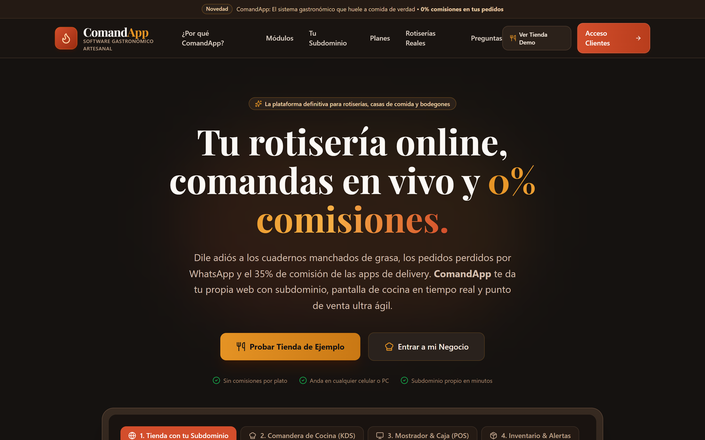

#### Demostrador Interactivo y Simulador de Subdominios
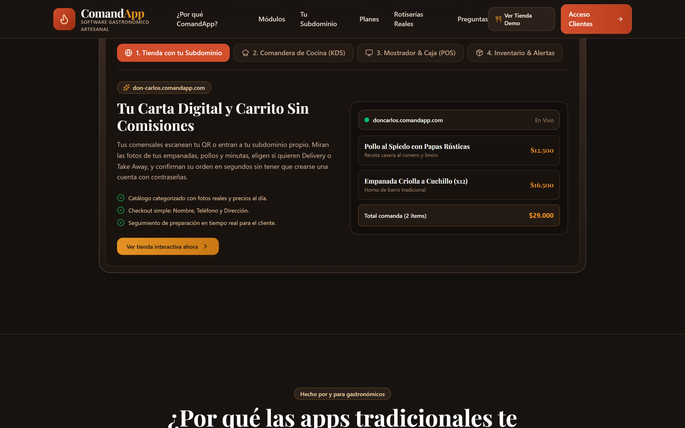

---

### 2. P-02: Tienda Online & Catálogo Artesanal (`/tienda`)
* **Propósito:** Cara pública del restaurante donde el comensal explora el menú categorizado (*Spiedo y Horno*, *Empanadas Caseras*, *Pastas*, *Minutas*).
* **Características:** Nombre del comercio, dirección, teléfono, demora estimada de cocina, fotos de platos, ingredientes y botón reactivo *"Pedir al plato"*.

#### Versión Escritorio (Desktop)
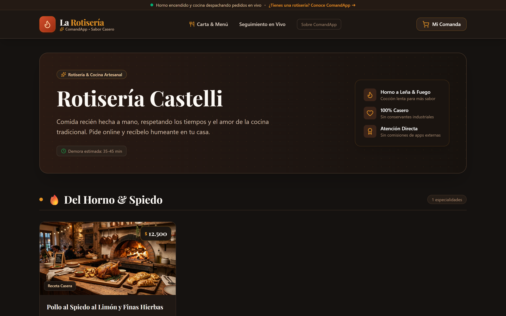

#### Versión Móvil (Mobile First)
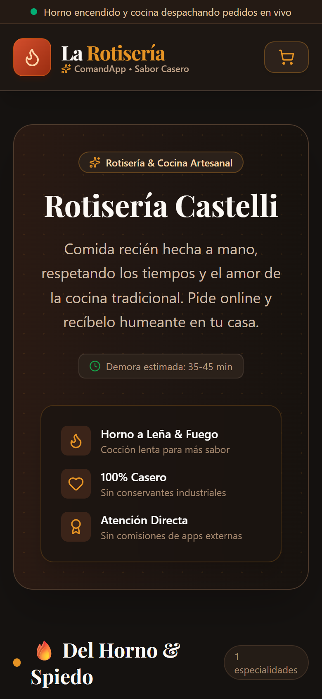

---

### 3. P-03: Carrito de Comanda y Checkout (`/carrito`)
* **Propósito:** Gestión ágil de artículos agregados a la comanda y confirmación directa sin registro forzoso.
* **Características:** Controles `+` / `-` de unidades, cálculo de subtotal, datos de cliente (Nombre, WhatsApp), selector de modalidad (*Envío a Domicilio* o *Retiro en Local*), forma de pago (*Efectivo*, *MercadoPago*) y aclaraciones para cocina.

#### Versión Escritorio (Desktop)
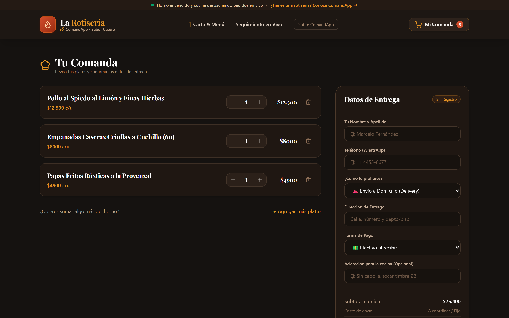

#### Versión Móvil (Mobile)
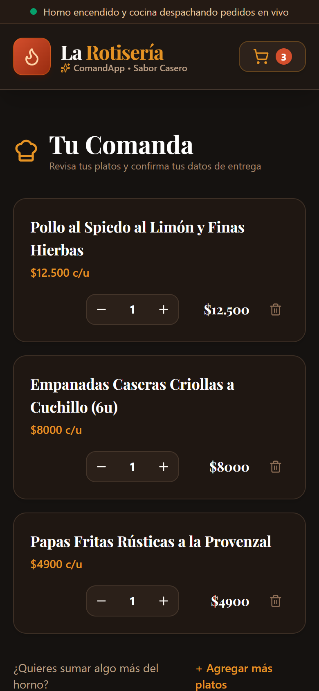

---

### 4. P-04: Seguimiento de Pedido en Vivo (`/seguimiento`)
* **Propósito:** Rastreo en tiempo real para el cliente tras realizar una comanda.
* **Características:** Línea de tiempo visual de 4 etapas (*Comanda Recibida*, *Marchando en el Fuego*, *¡Platos Listos!*, *Entregado*), código de orden, total y desglose de platos pedidos.

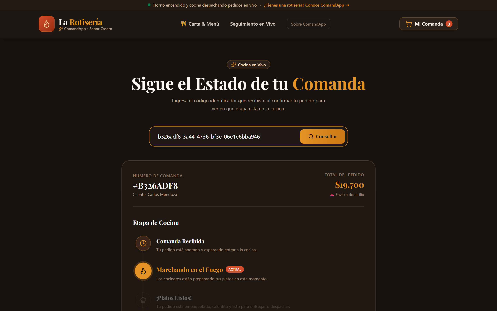

---

### 5. P-05: Inicio de Sesión de Personal (`/login`)
* **Propósito:** Acceso seguro al panel administrativo y operativo de cocina mediante Supabase Auth.
* **Características:** Formulario con estética rústica, validación de perfil y local asignado, y acceso rápido de demostración para presentaciones.

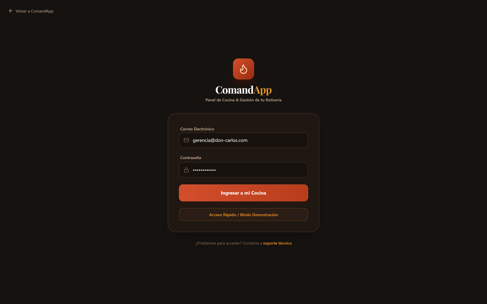

---

### 6. P-06: Panel Administrativo - Dashboard Gerencial (`/admin`)
* **Propósito:** Tablero de comando para el dueño o encargado con los indicadores clave de rendimiento (KPIs) del turno.
* **Características:** Ventas de hoy en pesos, cantidad de pedidos totales, ticket promedio por orden, insumos críticos y alertas rojas con botón de recarga rápida (+10 unidades).

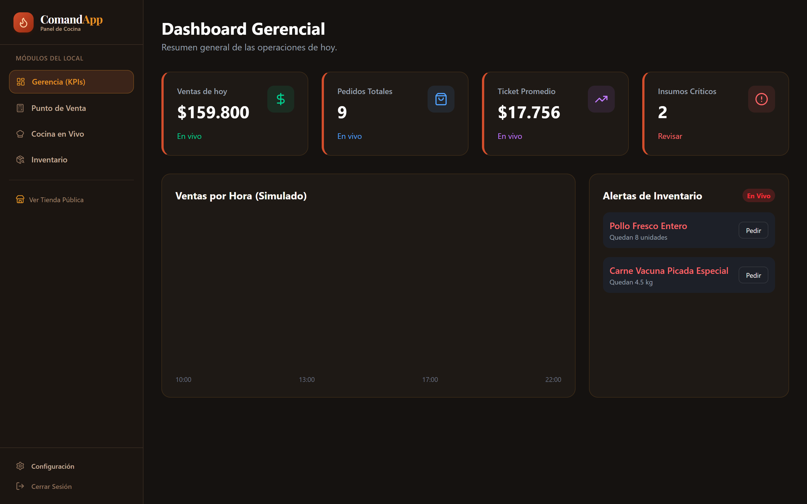

---

### 7. P-07: Punto de Venta de Mostrador / POS (`/admin/pos`)
* **Propósito:** Atención ultrarrápida para pedidos en mostrador físico y encargos telefónicos.
* **Características:** Buscador en vivo, filtros por tipo de plato, selección directa a comanda con un clic, desglose de ítems, cálculo automático del total a cobrar y disparo instantáneo a la pantalla de cocina.

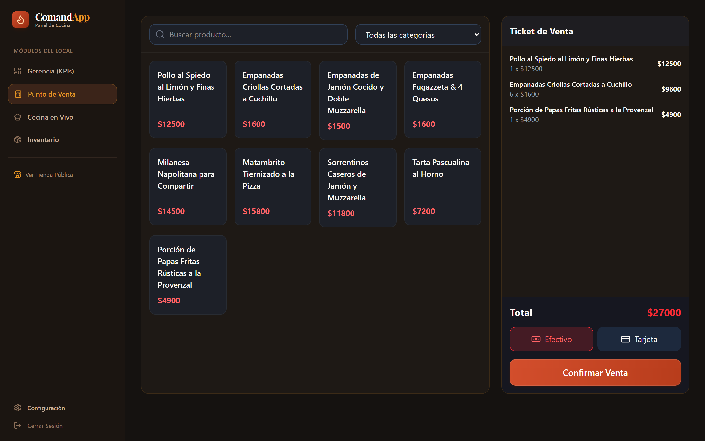

---

### 8. P-08: Comandera de Cocina en Vivo / KDS (`/admin/cocina`)
* **Propósito:** Pantalla táctil para la cocina que reemplaza las comandas de papel tradicionales.
* **Características:** Sincronización instantánea por WebSockets (sin F5), tarjetas organizadas en columnas (*Pendientes*, *En Preparación* con cronómetro, *Listos*), notas especiales resaltadas y botones de avance de comanda.

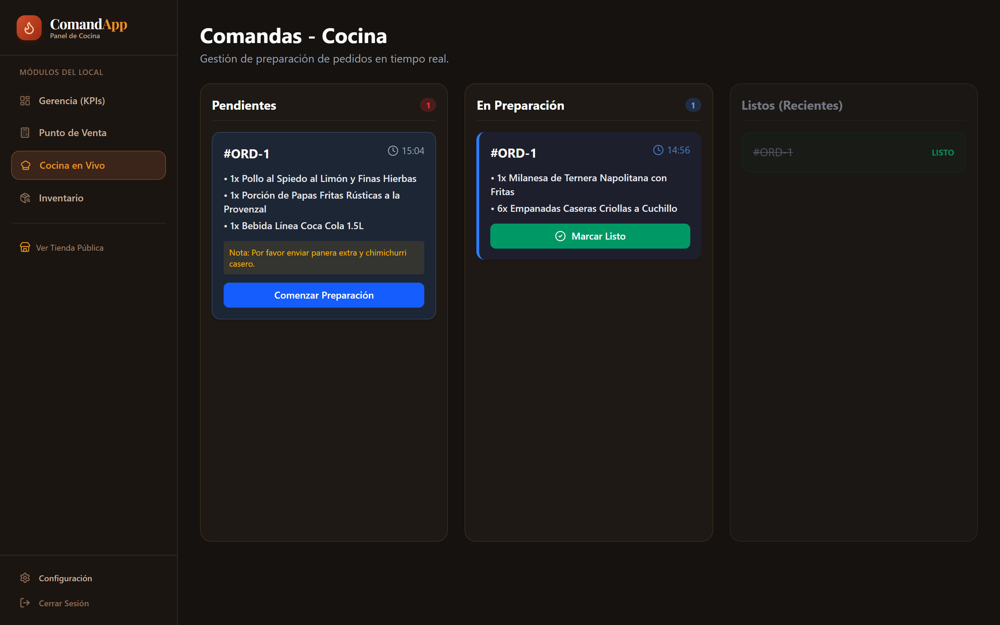

---

### 9. P-09: Control de Inventario y Stock (`/admin/inventario`)
* **Propósito:** Seguimiento de materias primas críticas para prevenir faltantes en cocina.
* **Características:** Tabla con stock disponible, unidad de medida (`kg`, `unidades`, `litros`), umbral mínimo (`min_stock`), alerta visual de insumo crítico y registro rápido de entradas de mercadería.

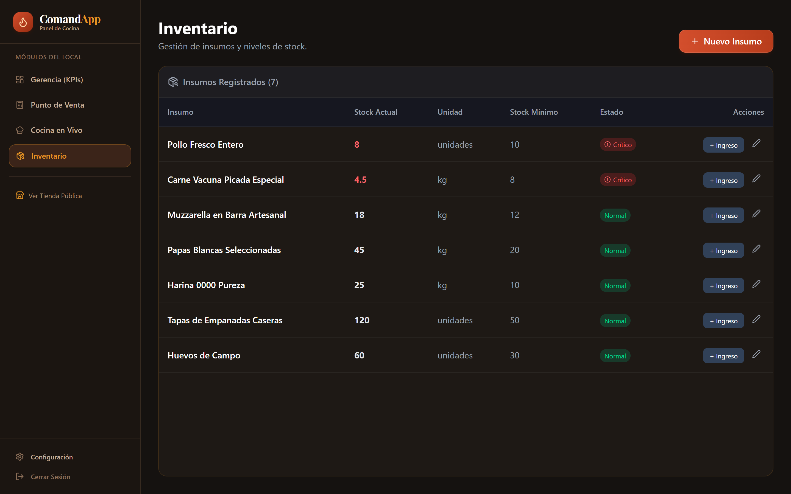

---

### 10. P-10: Configuración del Comercio (`/admin/configuracion`)
* **Propósito:** Administración de datos de identidad de cada local en la arquitectura multi-inquilino.
* **Características:** Nombre comercial, subdominio asignado (`.comandapp.com`), teléfono de contacto, dirección y propuesta gastronómica.

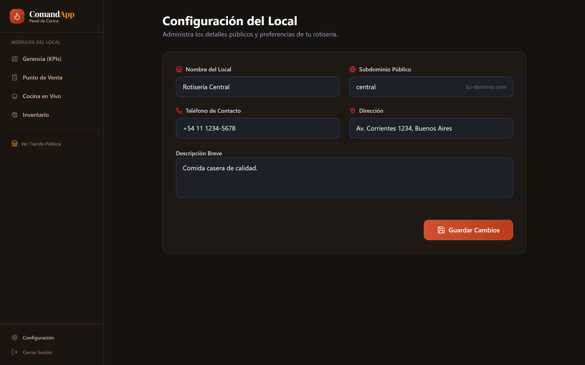

---

## 🗂️ Ubicación de los Archivos de Captura

Todas las imágenes se encuentran almacenadas en formatos de alta resolución (`PNG` a 2x escala de retina) en las siguientes carpetas del proyecto:
- **Ruta de documentación:** `docs/capturas/`
- **Ruta pública web:** `public/capturas/`
